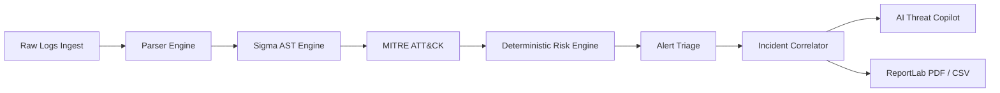

# Autonomous SOC Analyst (ASOC) — Architecture Specification

## 1. System Overview

The **Autonomous SOC Analyst (ASOC)** is an end-to-end, enterprise-grade Security Operations Center platform designed to automate detection, risk scoring, incident correlation, threat intelligence enrichment, and remediation workflows.

```text
React 18 SPA Frontend (Vite + Tailwind CSS + Lucide Icons)
      ↓ (HTTP / REST + Bearer JWT)
FastAPI REST API Server (Python 3.11 / Uvicorn)
      ↓ (Dependency Injection)
Service Layer (Business Logic & Domain Orchestration)
      ↓ (Transactions & Entity Management)
Repository Layer (CRUD & Query Builders)
      ↓ (ORM Mapping)
SQLAlchemy 2.0 (Dual-Engine: SQLite & PostgreSQL)
```

---

## 2. Core Processing Pipeline



1. **Ingestion & Validation**: Handles CSV, JSON, Syslog, and TXT security log streams with 50 MB limits and path sanitization.
2. **Parser Engine**: Normalizes diverse log schemas into standard `ParsedLog` events (`timestamp`, `source`, `source_ip`, `destination_ip`, `user`, `event_type`, `raw_data`).
3. **Sigma Detection Engine**: Compiles real YAML Sigma rules into Abstract Syntax Trees (ASTs) with condition expressions and field modifiers (`contains`, `endswith`, `re`).
4. **MITRE ATT&CK Framework**: Pre-seeded with 14 Enterprise Tactics (`TA0001` - `TA0043`) and mapped detection techniques (`T1110`, `T1059`, `T1105`, `T1558`, etc.).
5. **Deterministic Risk Engine**: Composite 0–100 risk score combining rule severity base, evaluator confidence, MITRE tactic weight, and asset criticality.
6. **Alerts & Incidents**: Auto-generates alerts above thresholds and correlates unassigned alerts sharing temporal and entity affinity into cases (`INC-YYYY-XXXX`).
7. **Autonomous AI Threat Copilot**: Multi-provider LLM interface (Ollama, OpenAI) with a resilient, offline Heuristic fallback guard guaranteeing zero downtime.
8. **Containment & Incident Workbench**: State machine transitions (`OPEN` $\rightarrow$ `INVESTIGATING` $\rightarrow$ `CONTAINED` $\rightarrow$ `RESOLVED` $\rightarrow$ `CLOSED`) with one-click host isolation, IP blacklisting, token revocation, and volatile memory capture.

---

## 3. Directory Structure

```text
├── backend/
│   ├── app/
│   │   ├── ai/               # AI Threat Hunter & Provider Abstractions
│   │   ├── api/v1/           # 17 REST API Controllers & Route Aggregator
│   │   ├── config/           # Pydantic Settings & Environment
│   │   ├── core/             # Exceptions, Constants, Lifespan, Logging
│   │   ├── database/         # SessionLocal, SQLite/Postgres Dual Hooks
│   │   ├── dependencies/     # Auth, RBAC, Services, Repositories
│   │   ├── logs/             # Raw Log Parsers (JSON, CSV, Syslog)
│   │   ├── middleware/       # CORS, Request Timing, Security Headers
│   │   ├── mitre/            # ATT&CK Framework Seeds & Service
│   │   ├── models/           # SQLAlchemy 2.0 ORM Entities & Enums
│   │   ├── repositories/     # Database Access Repositories
│   │   ├── risk/             # Explainable Risk Scoring Engine
│   │   ├── schemas/          # Pydantic Request/Response DTOs
│   │   ├── security/         # Password Hashing, JWT Tokens, RBAC
│   │   ├── services/         # Incident, Alert, Report, Upload Services
│   │   └── sigma/            # Rule Compiler, Loader, AST Evaluator
│   ├── migrations/           # Alembic Version Chain
│   ├── sigma_rules/          # 10 Core Production YAML Sigma Rules
│   └── tests/                # 23 Unit, Integration, and E2E Tests
├── frontend/
│   ├── src/
│   │   ├── components/       # Common Widgets, Navbar, Sidebar, Badges
│   │   ├── contexts/         # AuthContext & Session Management
│   │   ├── layouts/          # Responsive AppLayout Grid
│   │   ├── pages/            # 15 Complete SOC Operational Views
│   │   └── services/         # Axios API Client & Blob Interceptors
├── docker/                   # Dockerfiles & Multi-Stage Configs
├── docker-compose.yml        # Full-Stack Compose Orchestration
└── nginx.conf                # Edge Reverse Proxy Configuration
```
