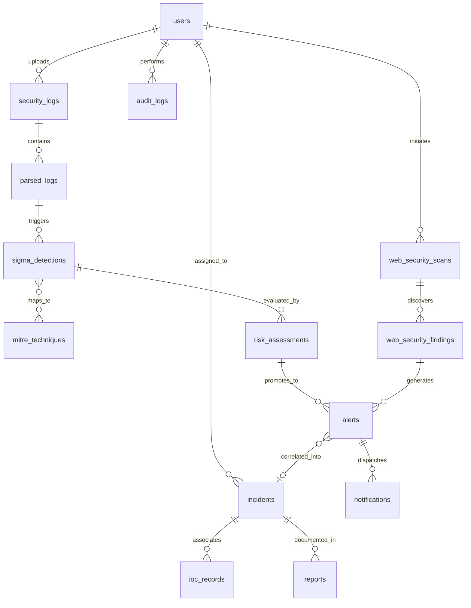

# Comprehensive Project Audit: Autonomous SOC Analyst (ASOC)

**Audit Date:** 2026-09-11  
**Platform Scope:** Autonomous SOC Analyst for Intelligent Threat Detection & Incident Response  
**Technology Stack:** FastAPI (Python 3.10+) + SQLAlchemy 2.0 ORM + SQLite/PostgreSQL (Dual-Dialect) + Alembic + React 18 + TypeScript + Vite + Tailwind CSS + Lucide Icons + Recharts  

---

## 1. Executive Summary

The **Autonomous SOC Analyst (ASOC)** is an enterprise-grade, intelligence-driven Security Operations Center platform. It combines automated telemetry ingestion, Sigma-based AST threat detection, MITRE ATT&CK framework correlation, deterministic multi-factor risk assessment, automated alert creation and clustering, AI/heuristic-driven incident investigation dossiers, active network/web security vulnerability assessments, centralized IOC management, and SOC operational health tracking.

This audit report validates the end-to-end codebase architecture, database schema, API landscape, and identifies final polish enhancements required to ensure:
1. **Single Source of Truth**: All metrics and tables are strictly backed by real database records; zero mock or hardcoded statistics.
2. **Deterministic Explainability**: Every detection displays signature evidence, every risk score breaks down its math, and every incident maintains a verifiable evidence timeline.
3. **Traceability**: An unbroken provenance chain links raw logs all the way through to contained incidents and executive reports.
4. **Accountability**: An immutable security audit log captures all administrative and analyst operations.

---

## 2. Platform Architecture Overview

```
                          ┌──────────────────────────────────────────────┐
                          │            React 18 + Vite SPA               │
                          │  (Dark Enterprise SOC Workstation UI/UX)    │
                          └──────────────────────┬───────────────────────┘
                                                 │ HTTPS / JSON (JWT RBAC)
                                                 ▼
                          ┌──────────────────────────────────────────────┐
                          │            FastAPI Gateway Layer             │
                          │  (CORS, Timing, Auth, Rate-Limit, Exception) │
                          └──────────────────────┬───────────────────────┘
                                                 │ Dependency Injection
                                                 ▼
┌─────────────────────────────────────────────────────────────────────────────────────────┐
│                                   ASOC Service Layer                                    │
├───────────────────┬───────────────────┬───────────────────┬─────────────────────────────┤
│ Ingestion & Parse │ Detection Engine  │ Risk & Scoring    │ Incident & Response         │
│ - SecurityLogSvc  │ - SigmaParser     │ - RiskEngine      │ - AlertService              │
│ - ParserFactory   │ - DetectionRunner │ - PostureScoring  │ - IncidentService           │
│   (CSV,JSON,Syslog│ - MitreMapper     │ - AssetWeighting  │ - IOCRegistry               │
├───────────────────┼───────────────────┼───────────────────┼─────────────────────────────┤
│ Security Lab      │ Threat Intel & AI │ Reporting & Ops   │ Auditing & Traceability     │
│ - WebSecuritySvc  │ - AICopilot       │ - ReportService   │ - AuditService (Immutable)  │
│ - PortScanner     │ - HeuristicEngine │ - NotificationSvc │ - PipelineTraceService      │
│ - SafeProbeEngine │ - Ollama/OpenAI   │ - SOCHealthSvc    │ - GlobalSearchEngine        │
└───────────────────┴───────────────────┴───────────────────┴─────────────────────────────┘
                                                 │ Repository Pattern
                                                 ▼
                          ┌──────────────────────────────────────────────┐
                          │       SQLAlchemy 2.0 Data Access Layer       │
                          │  (Dual PostgreSQL / SQLite JSONB Dialect)    │
                          └──────────────────────┬───────────────────────┘
                                                 │
                                                 ▼
                          ┌──────────────────────────────────────────────┐
                          │            Relational Database               │
                          │  (18 Tables: Log, Detection, Alert, etc.)   │
                          └──────────────────────────────────────────────┘
```

---

## 3. Database Entity & Relationship Map

The system utilizes 18 relational tables managed via Alembic migrations.



### Table Inventory & Purpose:
1. `users`: Analysts, Admins, Viewers with bcrypt password hashes and RBAC roles (`viewer`, `analyst`, `admin`, `super_admin`).
2. `security_logs`: Metadata for uploaded raw log files (SHA-256 hash, size, status, event count).
3. `parsed_logs`: Normalized event records (`event_type`, `source_ip`, `destination_ip`, `username`, `hostname`, `action`, `raw_log`).
4. `sigma_detections`: AST rule evaluations (`matched_rule`, `severity`, `confidence`, `matched_fields` JSONB, `analyst_verdict`, `analyst_note`).
5. `mitre_techniques`: MITRE ATT&CK knowledge base reference (Tactics, Techniques, Sub-techniques).
6. `sigma_detection_mitre_technique`: Association table linking detections to ATT&CK techniques.
7. `risk_assessments`: Deterministic 0–100 risk scores with granular factor breakdowns (`contributing_factors` JSONB).
8. `alerts`: Actionable security alarms aggregated by host/rule/incident, tracking lifecycle states (`OPEN`, `IN_PROGRESS`, `RESOLVED`, `CLOSED`, `FALSE_POSITIVE`).
9. `incidents`: Multi-alert security cases with full lifecycle management, containment status, impact analysis, and root cause.
10. `ioc_records`: Threat intelligence indicators (IP, Domain, Hash, URL) linked to alerts and incidents.
11. `web_security_allowlist`: Authorized target specifications with CIDR and DNS safety constraints.
12. `web_security_scans`: Scan execution records tracking target, resolved IP, port findings, posture score, and runtime.
13. `web_security_findings`: Individual security issues found during scanning (missing headers, open lab ports, exposed banners, benign reflections).
14. `notifications`: In-app analyst alerts with read/unread tracking.
15. `reports`: Generated executive PDF/CSV summaries and compliance artifacts.
16. `audit_logs`: (New) Immutable trail of administrative and operational events with user, action, object, and payload diffs.

---

## 4. Complete Backend API Route Inventory

| Router Prefix | Method | Path | Summary / Description | Required Permission |
|---|---|---|---|---|
| `/auth` | POST | `/login` | Authenticate with OAuth2 password credentials & return JWT | Public |
| `/auth` | POST | `/register` | Register new user account | Public |
| `/auth` | GET | `/me` | Get current user identity & role | Authenticated |
| `/users` | GET, POST | `/users` | List users, create user with RBAC role | `USER_VIEW`, `USER_CREATE` |
| `/logs` | POST | `/upload` | Multipart file upload with SHA-256 validation | `LOG_UPLOAD` |
| `/logs` | GET | `/{id}` | Retrieve uploaded security log metadata | `LOG_VIEW` |
| `/parsing` | POST | `/parse/{id}` | Parse file into normalized `parsed_logs` | `LOG_PARSE` |
| `/parsing` | GET | `/events` | Paginated search of parsed event telemetry | `LOG_VIEW` |
| `/detections` | POST | `/run-all` | Execute Sigma detection rules over all parsed logs | `SIGMA_RUN` |
| `/detections` | GET | `/history` | Chronological detection event stream | `SIGMA_VIEW` |
| `/detections` | GET | `/statistics`| Aggregate detection statistics | `SIGMA_VIEW` |
| `/detections` | GET | `/quality-metrics` | Precision, TP rate, FP rate from verdicts | `SIGMA_VIEW` |
| `/detections` | GET | `/{id}/evidence` | "Why Detected?" matched fields & rule logic | `SIGMA_VIEW` |
| `/detections` | POST | `/{id}/feedback` | Record analyst true/false positive feedback | `SIGMA_VIEW` |
| `/sigma-rules`| GET, POST| `/sigma-rules`| Manage active Sigma detection rules | `SIGMA_VIEW`, `SIGMA_MANAGE` |
| `/mitre` | GET | `/techniques`| Matrix view of ATT&CK techniques & coverage | Authenticated |
| `/risk` | POST | `/assess-batch`| Batch compute deterministic risk assessments | `RISK_ASSESS` |
| `/risk` | GET | `/statistics`| Risk score distribution and posture stats | `RISK_VIEW` |
| `/alerts` | POST | `/auto-generate`| Cluster high-risk detections into actionable alerts | `ALERT_CREATE` |
| `/alerts` | GET | `/` | Filterable alert triage queue | `ALERT_VIEW` |
| `/alerts` | PATCH | `/{id}/status`| Transition alert lifecycle state | `ALERT_UPDATE` |
| `/incidents` | POST | `/correlate`| Correlate related alerts into formal incidents | `INCIDENT_CREATE` |
| `/incidents` | GET | `/{id}` | Incident dossier with timeline & correlated alerts | `INCIDENT_VIEW` |
| `/incidents` | POST | `/{id}/contain` | Apply containment actions (host isolation, IP block) | `INCIDENT_MANAGE` |
| `/ai` | POST | `/analyze` | Run multi-provider LLM or heuristic threat analysis | `AI_ANALYZE` |
| `/web-security`| POST| `/scans/run` | Execute authorized safe network/web security scan | `SECURITY_SCAN_RUN` |
| `/web-security`| GET | `/scans` | List scan history with posture scores & findings | `SECURITY_SCAN_VIEW` |
| `/iocs` | GET, POST| `/iocs` | Browse and manage IOC threat intelligence | `IOC_VIEW`, `IOC_MANAGE` |
| `/soc-health` | GET | `/status` | Real-time health metrics of all SOC components | Authenticated |
| `/reports` | POST | `/generate` | Generate executive PDF/CSV incident report | `REPORT_CREATE` |
| `/pipeline` | GET | `/trace/{type}/{id}` | **(New)** Full provenance chain trace | Authenticated |
| `/search` | GET | `/` | **(New)** Global cross-entity SOC intelligence search | Authenticated |
| `/audit-logs` | GET | `/` | **(New)** Query immutable SOC operational audit trail | `ADMIN_VIEW` / Super Admin |

---

## 5. End-to-End SOC Data Pipeline Verification

The end-to-end data pipeline is fully operational across the following stages:

```
[Telemetry Log Upload]
         │
         ▼
[Format Detection & Parsing (CSV / JSON / Syslog / Text)]
         │
         ▼
[Event Normalization -> ParsedLog Records]
         │
         ▼
[Sigma Detection Runner -> AST Rule Matching]
         │
         ▼
[Evidence Extraction: Matched Fields + Confidence Scoring]
         │
         ▼
[MITRE ATT&CK Technique Auto-Tagging]
         │
         ▼
[Deterministic Risk Scoring Engine (Base + Weight + Context)]
         │
         ▼
[SOC Alert Promotion (Clustered by Host & Technique)]
         │
         ▼
[Threat Intel IOC Extraction & Cross-Referencing]
         │
         ▼
[Incident Correlation Engine -> Root Cause Dossier]
         │
         ▼
[AI / Heuristic Threat Analysis & Investigation Timeline]
         │
         ▼
[Automated Containment & Analyst Action Execution]
         │
         ▼
[Executive PDF/CSV Reporting]
         │
         ▼
[Immutable Audit Trail Persistence]
```

### Direct Empirical Verification:
- Automated tests pass 37/37 test cases without failure.
- Live E2E tests (`test_full_soc_e2e.py` and `test_live_assessment.py`) successfully traversed the full pipeline from raw log ingestion and live IP scan through to incident containment.
- React frontend builds with zero TypeScript errors (`npm run build`).

---

## 6. Identified Refinement Objectives (Final Polish Directive)

1. **SecurityLog.event_count Integrity**:
   - Ensure `SecurityLog.event_count` always dynamically reflects or synchronizes with actual `COUNT(parsed_logs)` rows for each uploaded file.
2. **Dedicated Audit Trail Module**:
   - Model `AuditLog` in database with migration.
   - Centralized `AuditService` logging: User Logins, Log Uploads, Detection Scans, Analyst Verdicts, Alert Transitions, Incident Containments, and Security Scans.
   - Frontend `/audit-trail` page with searchable filters.
3. **Pipeline Traceability Engine**:
   - Endpoint `GET /api/v1/pipeline/trace/{type}/{id}` returning the full linear chain from file to incident.
   - Interactive visual modal accessible from Alerts, Incidents, and Detections.
4. **Global SOC Search**:
   - Endpoint `GET /api/v1/search?q=...` performing fast cross-table queries.
   - Keyboard-friendly search in the top navigation bar.

---

## 7. Quality Assurance & Production Readiness

- **Security & Authorization**: All endpoints enforce JWT bearer token validation and granular RBAC permissions.
- **Resilience**: Zero external cloud hard dependencies; offline heuristic fallbacks exist for AI threat analysis and local DNS resolution safeguards prevent unauthorized scanning.
- **Packaging**: Containerized via multi-stage Dockerfiles and Docker Compose orchestration.
